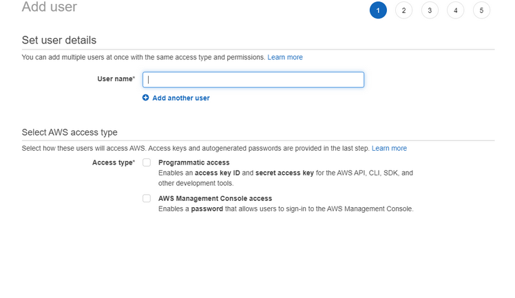
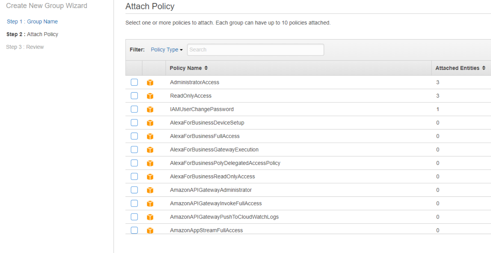
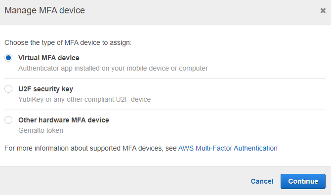

# Lab for configuring permissions in IAM

Lab for configuring permissions in IAM, according to AWS best practices.

## Adding a new User

In this section, we will create a user with administrator permissions using the AWS Console.

1. Access the AWS Dashboard for IAM (https://console.aws.amazon.com/iam/home)
2. Click on Users
3. Click on Add User

4. Define the user name and choose the access type.

Select Programmatic Access to allow use of the CLI, or AWS Management Console Access to allow login and access through the AWS console. Click on Next: Permissions.

5. In the Groups section, we would include this user in a group, but we will address the Groups section in another part of this tutorial.
6. Select the "Attach existing policies directly" tab and choose the permission that this user needs. In this tutorial, we will choose AdministratorAccess (in practice, be very careful when using this type of permission). Click on Next: Tags.
7. In this section, we can define tags to facilitate management.

## Adding a new group

1. To create a group, access the IAM dashboard, click on Groups on the left side of the screen, and then click on Create New Group

2. Define the group name and click on Next Step.

3. Choose the permission that will be associated with this group.

This means that any user that is added to this group will have these permissions. For this tutorial, we will choose the AdministratorAccess permission and click on Next Step.

##  Adding Users to the Group

1. In the created group, click on Add Users to Group.
2. Select the user you would like to add to the group and click on Add Users.

## Adding MFA to the Root Account

1. Access the main screen of the IAM Dashboard, click on Activate MFA on your root account and then click on Manage MFA
2. Click on Activate MFA.
3. Choose one of the three options:

The first is to add Virtual MFA, using an application like Google Authenticator or Authy, for example, the second is for physical MFA, and the third is for another type of MFA. For this tutorial, we will use Virtual MFA.

4. Use Google Authenticator or Authy to scan the QR Code and get the code to configure.