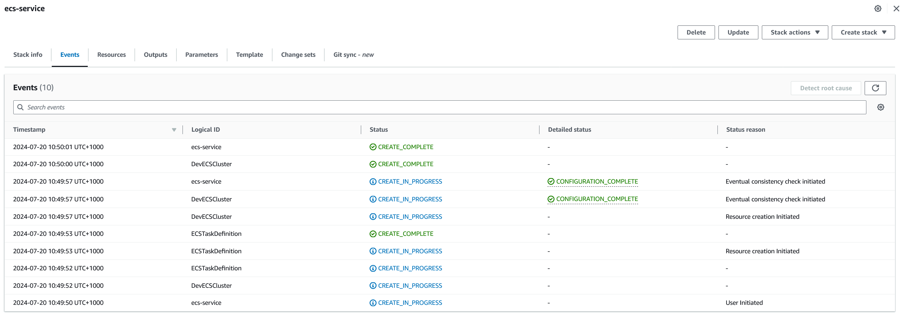

# Deploying ECS Cluster, Containers and Load Balancer using CloudFormation

1. Deploy the ECS cluster using the following CloudFormation code


```yaml

AWSTemplateFormatVersion: '2010-09-09'
Resources:
  # VPC
  EcsVPC:
    Type: AWS::EC2::VPC
    Properties:
      CidrBlock: 10.0.0.0/16
      EnableDnsSupport: True
      InstanceTenancy: default

  # Public Subnet (Modify for private or VPC endpoints if needed)
  PublicSubnet1:
    Type: AWS::EC2::Subnet
    Properties:
      AvailabilityZone: !GetAZs None
      VpcId: !Ref EcsVPC
      CidrBlock: 10.0.1.0/24
      MapPublicIpOnLaunch: True

  # Internet Gateway (Modify for private or VPC endpoints if needed)
  InternetGateway:
    Type: AWS::EC2::InternetGateway
    

  # VPC Gateway Attachment (Modify for private or VPC endpoints if needed)
  VPCGatewayAttachment:
    Type: AWS::EC2::VPCGatewayAttachment
    Properties:
      VpcId: !Ref EcsVPC
      InternetGatewayId: !Ref InternetGateway

  # ECS Cluster
  DevECSCluster:
    Type: AWS::ECS::Cluster
    Properties:
      ClusterName: MyFargateCluster
      CapacityProviders:
        - FARGATE

Outputs:
  VPCId:
    Description: VPC ID
    Value: !Ref EcsVPC
  ClusterName:
    Description: ECS Cluster Name
    Value: !Ref DevECSCluster


```

First we are going to validate the code using 

```bash

aws cloudformation validate-template --template-body file://docs/labs/cloudformation/ecs/ecs-cluster-vpc.yaml

```


2. Deploy the code using the CloudFormation `create-stack`


```bash
 
aws cloudformation create-stack --stack-name dev-ecs-cluster --template-body file://docs/labs/cloudformation/ecs/ecs-cluster-vpc.yaml --capabilities CAPABILITY_IAM

```
The feature `capabilities` can be used to specify the capabilities of the stack. In this case we need to create IAM so we need to specify this capability.

3. After this the ECS cluster stack is created



4. Create an Application Load balancer